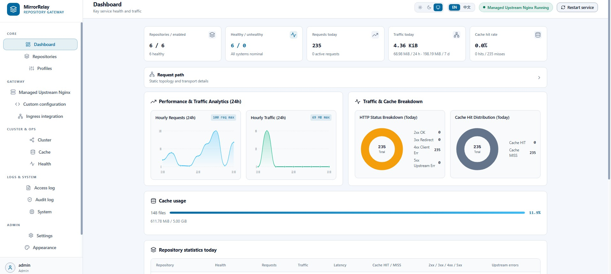

# MirrorRelay

[English](README.md) | [简体中文](README.zh-CN.md)

[](https://github.com/LuisCMerrick/MirrorRelay/actions/workflows/ci.yml)
[](https://github.com/LuisCMerrick/MirrorRelay/actions/workflows/build.yml)
[](https://github.com/LuisCMerrick/MirrorRelay/releases)
[](LICENSE)

A self-hosted pull-through caching gateway for Linux package repositories and OCI container registries with a web management UI and managed Nginx data plane.

```text
APT · RPM · APK · OPKG · PyPI · npm · Maven · NuGet · Cargo · Go Proxy · Conda · Docker / OCI

No full mirror synchronization required.
```

```text
Clients (apt / dnf / pip / npm / docker)
   │
   ▼
External Shared Nginx (Ingress: 80 / 443)
   │
   ▼
MirrorRelay (Go Control Plane & Router)
   │
   ▼
Managed Upstream Nginx (Isolated Data Plane) ──► Original Upstreams
```



---

## Why MirrorRelay?

Common approaches include full mirror synchronization, repository managers, or manually maintained reverse-proxy configurations. MirrorRelay solves the fundamental drawbacks of these approaches:

| Challenge | Full Mirror Sync (e.g. `apt-mirror`, `bandersnatch`) | Manual Nginx `proxy_pass` | MirrorRelay |
|---|---|---|---|
| **Storage Consumption** | Requires hundreds of gigabytes or terabytes upfront | Low (caches on demand) | **Low**: Pull-through on-demand disk cache |
| **Initial Sync Delay** | Hours to days before first use | Zero delay | **Zero delay**: Immediate availability |
| **Repository Management** | Complex sync scripts and cron jobs | Manual config editing and reloads | **Web UI & API**: Real-time CRUD with audit log |
| **Docker / OCI Registry** | Difficult to mirror private/public registries | Requires additional handling for Bearer-token authentication and redirected blob downloads | **Built-in Token & Redirect Broker** |
| **Configuration Lifecycle** | N/A | Validation/reload must be implemented operationally | **Built-in candidate validation and atomic publication** (`nginx -t` before reload) |
| **Upstream Security** | N/A | Dynamic upstream configuration requires explicit SSRF and DNS-rebinding defenses | **Strict CIDR filtering, IP pinning & TLS SNI verification** |
| **Multi-Node Routing** | Manual DNS / CDN configuration | Complex geo-DNS setup | **Coordinator / Edge distributed 307 routing** |

---

## Capabilities

| Feature | Status | Details |
|---|---|---|
| **Package Repository Proxy & Cache** | ✅ Supported | APT, RPM/DNF, APK, OPKG, PyPI, npm, Maven, NuGet, Cargo, Go Proxy, Conda |
| **Docker / OCI Registry Pull Proxy** | ✅ Supported | Full `/v2/` challenge handling, Token Brokerage, multi-upstream fallback, CDN redirect handling |
| **Multi-Upstream Failover** | ✅ Supported | Automatic health checking, weight, priority, and backup upstream fallback |
| **Desired / Active Separation** | ✅ Supported | Atomic configuration generation, `nginx -t` validation, and hitless graceful reload |
| **Distributed Package Routing** | ✅ Supported | Coordinator / Edge topology with client CIDR, Geo, Priority, and Weight 307 routing |
| **Edge Configuration Consistency** | ✅ Supported | Real-time fingerprint and version check between Coordinator and Edge nodes |
| **Docker / OCI Distributed Routing** | 🚧 Planned | Docker registry distributed routing is planned for future control-plane updates (single-node OCI pull proxy is fully supported) |
| **Bilingual Web Management UI** | ✅ Supported | Zero-dependency responsive UI in English and Chinese with persistent switch and live restart |

---

## Target Compatibility

| Ecosystem | Proxy Mode | Dynamic Cache | Metadata / URL Rewrite | Verified Versions |
|---|:---:|:---:|:---:|---|
| **APT** | ✅ | ✅ | Optional HTML URL rewrite | Debian 11/12, Ubuntu 22.04/24.04 |
| **RPM / DNF** | ✅ | ✅ | Optional HTML URL rewrite | Rocky Linux 8/9, AlmaLinux 9, Fedora 40/41 |
| **Alpine APK** | ✅ | ✅ | N/A | Alpine 3.19/3.20/3.21 |
| **OpenWrt OPKG** | ✅ | ✅ | Optional HTML URL rewrite | OpenWrt 22.03/23.05 |
| **PyPI** | ✅ | ✅ | ✅ Simple HTML Index Rewrite | `pip` 23.x/24.x |
| **npm** | ✅ | ✅ | ✅ JSON Registry Metadata Rewrite | `npm` 9.x/10.x, `pnpm`, `yarn` |
| **Go Modules** | ✅ | ✅ | N/A | Go 1.22/1.23/1.24 |
| **Rust Cargo** | ✅ | ✅ | N/A | Cargo / `crates.io` index |
| **NuGet** | ✅ | ✅ | Optional V3 Index Rewrite | `nuget.exe`, `dotnet` CLI |
| **Maven / Gradle** | ✅ | ✅ | Optional HTML directory rewrite | Maven 3.8/3.9, Gradle 8.x |
| **Docker / OCI** | ✅ Pull | ✅ Layers & Blobs | ✅ Token & S3/CDN Redirect Broker | Docker Engine 24.x/26.x/27.x, Podman 4.x/5.x |

> *Versions listed here are explicitly tested; newer compatible versions may also work.*

---

## Quick Start

The latest multi-architecture image is `luiscmerrick/mirrorrelay:latest`:
[https://hub.docker.com/r/luiscmerrick/mirrorrelay:latest](https://hub.docker.com/r/luiscmerrick/mirrorrelay:latest).
Production traffic still follows the required External Shared Nginx →
MirrorRelay frontend → Managed Upstream Nginx path.

### Option 1: Start the latest image directly with Docker

Create the fixed private bridge once, then start the non-root container with
persistent state/cache/log volumes and a UID/GID-scoped runtime tmpfs:

```bash
docker network create --driver bridge --subnet 172.31.255.0/24 --gateway 172.31.255.1 mirrorrelay-net

docker run -d \
  --name mirrorrelay \
  --restart unless-stopped \
  --network mirrorrelay-net \
  --publish 127.0.0.1:9081:9081 \
  --volume mirrorrelay-data:/var/lib/mirrorrelay \
  --volume mirrorrelay-cache:/var/cache/mirrorrelay \
  --volume mirrorrelay-logs:/var/log/mirrorrelay \
  --tmpfs /run/mirrorrelay:rw,nosuid,nodev,noexec,mode=0770,uid=65532,gid=65532 \
  luiscmerrick/mirrorrelay:latest
```

The bundled Docker configuration trusts the fixed bridge gateway and disables
cross-boundary zero-copy because the runtime socket is container-private.
Connect administrator-owned External Shared Nginx to host `127.0.0.1:9081`,
review the generated ingress configuration, and set the exact administration
CIDRs before exposing the service. See the [Installation Guide](docs/installation.md).

### Option 2: Start with `compose.yaml`

```bash
git clone https://github.com/LuisCMerrick/MirrorRelay.git
cd MirrorRelay
sudoedit configs/config.docker.yaml
docker compose pull
docker compose up -d
```

The Compose model uses `luiscmerrick/mirrorrelay:latest` by default. Set
`MIRRORRELAY_IMAGE_TAG` to an immutable release tag when pinning a deployment.

### Option 3: Install a release package (DEB / RPM)

```bash
# Debian / Ubuntu (amd64 example):
sudo apt-get install --yes ./mirrorrelay_0.0.17_amd64.deb

# RHEL / Rocky Linux / Fedora (amd64 example):
sudo dnf install --yes ./mirrorrelay-0.0.17.x86_64.rpm

sudoedit /etc/mirrorrelay/config.yaml
sudo systemctl enable --now mirrorrelay.service
```

Packages also ship for arm64/aarch64. Apply the generated External Shared Nginx
snippet from `/var/lib/mirrorrelay/integration/external-nginx/mirrorrelay.conf`
using that ingress installation's normal maintenance process.

### Option 4: Run from source in development mode

```bash
git clone https://github.com/LuisCMerrick/MirrorRelay.git
cd MirrorRelay
go run ./cmd/mirrorrelay -dev
```

Open `https://127.0.0.1:8443/admin/`, accept the local development certificate,
and register the initial administrator. The checked-in development Nginx fixture
is for Linux amd64; formal amd64 and arm64 deployments should use the published
image or packages.

### Example Repository & Client Setup

1. **Add Debian Repository** in Web UI:
   - Name: `debian`, Slug: `debian`, Type: `apt`, Public Path: `/debian`
   - Upstream URL: `https://deb.debian.org/debian`
2. **Configure Client** using either DEB822 (`/etc/apt/sources.list.d/mirrorrelay.sources`):
   ```text
   Types: deb
   URIs: https://mirror.example.com/debian/
   Suites: bookworm
   Components: main contrib non-free non-free-firmware
   Signed-By: /usr/share/keyrings/debian-archive-keyring.gpg
   ```
   or the traditional one-line format (`/etc/apt/sources.list.d/mirrorrelay.list`):
   ```text
   deb [signed-by=/usr/share/keyrings/debian-archive-keyring.gpg] https://mirror.example.com/debian/ bookworm main contrib non-free non-free-firmware
   ```
3. **Verify**:
   ```bash
   sudo apt-get update
   ```

For detailed setup instructions, see the [Quick Start Guide](docs/quick-start.md) and [Installation Guide](docs/installation.md).

---

## Architecture Overview

MirrorRelay uses a clean two-plane architecture separating administrative control from high-throughput upstream data transfer:

```text
External Shared Nginx (Administrator-Owned)
         ↓  (TCP 127.0.0.1:9081 by default; Unix Socket 0660 is opt-in)
MirrorRelay Frontend (Go Service)
  - Policy enforcement & Authentication
  - Dynamic routing & URL rewriting
  - Token brokerage for OCI registries
  - Configuration lifecycle (Desired state in SQLite)
         ↓  (Unix Socket 0660 by default; Loopback TCP is opt-out)
Managed Upstream Nginx (Isolated Musl Process)
  - Proxy caching on local disk (/var/cache/mirrorrelay)
  - Connection pooling & SSL verification
  - DNS resolution & pinning
         ↓
Original Upstream (HTTPS / HTTP)
```

- **Safety Invariant**: The Go service never makes direct HTTP calls to upstream package servers. All upstream communication is performed exclusively through the isolated, statically linked `Managed Upstream Nginx` data plane.
- **Hitless Reloads**: Configuration updates are compiled into a candidate Nginx configuration, validated with `nginx -t`, atomically written, and reloaded gracefully (`HUP`) without dropping active connections.

Read more in the [Architecture Guide](docs/architecture.md).

---

## Distributed Deployment

MirrorRelay includes native clustering capabilities to scale traffic across geographical regions or edge locations:

- **Coordinator Node**: Central management authority owning repository definitions, client routing rules, and node health monitoring.
- **Edge Nodes**: Autonomous caching nodes that receive traffic directly from clients via HTTP 307 redirects from the Coordinator.
- **Routing Policies**: Client IP CIDR matching, Geo-location, Priority, and Weight balancing.
- **Cluster Failover**: If an Edge node fails health checks, the Coordinator automatically routes traffic to the next healthy candidate node (or returns HTTP 503 if all edge nodes are unreachable).

Read more in the [Distributed Deployment Guide](docs/distributed.md).

---

## Release Packages and Container Image

Pre-compiled, statically linked packages are produced for `linux/amd64` and `linux/arm64`:

| Architecture | DEB | RPM | Tarball Archive |
|---|---|---|---|
| **amd64** | `mirrorrelay_<version>_amd64.deb` | `mirrorrelay-<version>.x86_64.rpm` | `mirrorrelay-<version>-linux-amd64.tar.gz` |
| **arm64** | `mirrorrelay_<version>_arm64.deb` | `mirrorrelay-<version>.aarch64.rpm` | `mirrorrelay-<version>-linux-arm64.tar.gz` |

Every GitHub Release also includes the architecture-neutral `mirrorrelay-<version>-source-with-vendor.tar.gz`, containing the tracked source tree plus a generated Go `vendor/` directory for offline and reproducible source builds.

The same release publishes `<dockerhub-namespace>/mirrorrelay:<version>` as one
Docker Hub OCI manifest covering both architectures. It also publishes
`v<version>` and, for stable releases, `latest`; the digest recorded by the
release workflow is the immutable identity.

Standard file layout:
```text
/usr/bin/mirrorrelay                         # Main Go service binary
/usr/lib/mirrorrelay/nginx/nginx             # Version-bound musl Managed Upstream Nginx
/etc/mirrorrelay/config.yaml                 # Configuration file (mode 0640)
/usr/lib/systemd/system/mirrorrelay.service  # Sandboxed systemd service unit
/var/lib/mirrorrelay/mirrorrelay.db          # Persistent SQLite database
/var/cache/mirrorrelay/                      # Upstream package and blob disk cache
/var/log/mirrorrelay/upstream-nginx/         # Access and error logs
/run/mirrorrelay/                            # Runtime PID and Unix domain sockets
```

---

## Documentation

- **Getting Started**:
  - [Quick Start Guide](docs/quick-start.md) ([中文](docs/quick-start.zh-CN.md)) — 5-minute onboarding walkthrough.
  - [Installation Guide](docs/installation.md) ([中文](docs/installation.zh-CN.md)) — Production packages, tarballs, and Docker image deployment.
  - [Web UI Guide](docs/web-ui.md) ([中文](docs/web-ui.zh-CN.md)) — Bilingual dashboard, settings, and repository actions.
- **Architecture & Deep Dives**:
  - [Architecture Guide](docs/architecture.md) ([中文](docs/architecture.zh-CN.md)) — Two-plane design, lifecycle, and data flow.
  - [Docker & OCI Registry](docs/docker-oci.md) ([中文](docs/docker-oci.zh-CN.md)) — Token brokerage, redirect handling, and setup.
  - [Distributed Deployment](docs/distributed.md) ([中文](docs/distributed.zh-CN.md)) — Coordinator, Edge, and 307 routing.
  - [Security Model](docs/security.md) ([中文](docs/security.zh-CN.md)) — SSRF mitigation, token hashing, and isolation.
- **Reference & Operations**:
  - [Configuration Reference](docs/configuration.md) ([中文](docs/configuration.zh-CN.md)) — Complete YAML configuration guide.
  - [Production Verification](docs/verification.md) ([中文](docs/verification.zh-CN.md)) — Large object, throughput, and failover validation.
  - [Example Configuration](configs/config.example.yaml) — Production-ready YAML template.
  - [Roadmap](ROADMAP.md) — Future development milestones.
  - [Contributing Guide](CONTRIBUTING.md) — Development workflow and coding guidelines.

---

## Security

Security vulnerabilities should be reported responsibly according to our [Security Policy](.github/SECURITY.md).

---

## License

MirrorRelay is licensed under the [GNU General Public License v3.0](LICENSE).  
Third-party component licenses for bundled Nginx dependencies (musl, OpenSSL, PCRE2, zlib) are documented in [nginx/NOTICE.md](nginx/NOTICE.md).
